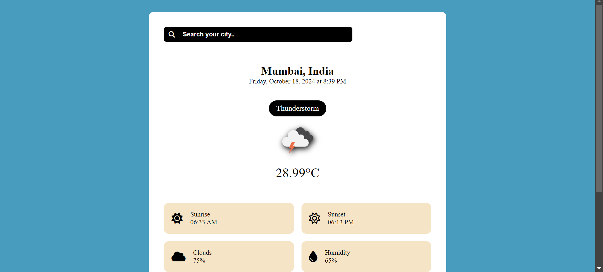
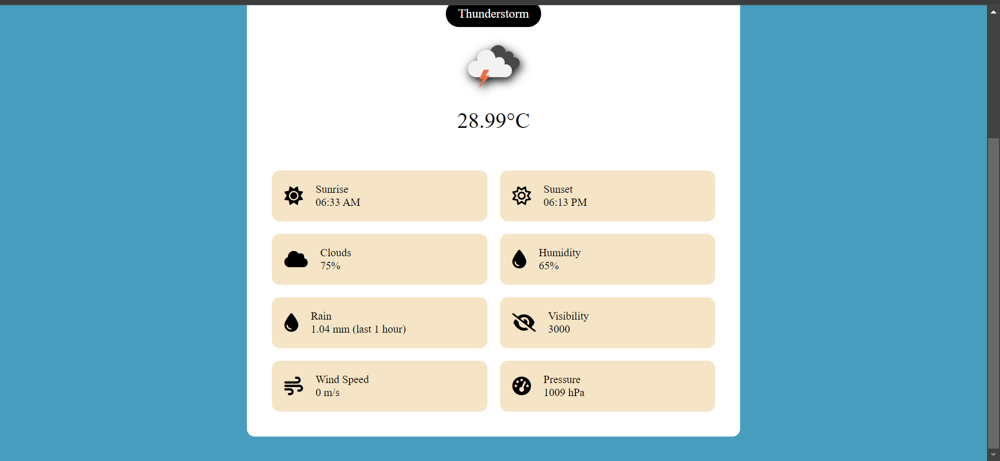

# Weather Application

## Description

This Weather Application provides real-time weather information for any city. Users can input a city name to retrieve data such as temperature, weather conditions, humidity, wind speed, and more. The application is designed to be user-friendly and visually appealing, displaying all relevant weather details clearly.

## Features

- Search for weather information by city name
- Displays current date and time
- Shows temperature with an icon representing weather conditions
- Provides cloud coverage percentage
- Displays humidity levels
- Shows rainfall information
- Provides visibility distance
- Displays sunrise and sunset times
- Shows wind speed
- Displays atmospheric pressure

## Features

- **City Name**: Name of the city for which the weather data is fetched.
- **Date**: Current date.
- **Time**: Current time in the city.
- **Temperature**: Current temperature in degrees Celsius or Fahrenheit.
- **Icon**: Weather condition icon (e.g., sunny, cloudy, rainy).
- **Clouds**: Percentage of cloud coverage.
- **Humidity**: Current humidity level as a percentage.
- **Rain**: Amount of rainfall (if applicable).
- **Visibility**: Visibility distance in meters or kilometers.
- **Sunrise**: Sunrise time.
- **Sunset**: Sunset time.
- **Wind Speed**: Speed of the wind.
- **Pressure**: Atmospheric pressure.

## Technologies Used

- **HTML**: For the structure of the web application.
- **CSS**:For styling the application and enhancing user experience.
- **JavaScript**: For implementing the application logic and handling API requests.
- **API**: OpenWeatherMap API: For retrieving weather data.

## Screenshots

To provide a better understanding of the Canvas Connect application, here is a screenshot:

##Main Interface

##Search Interface

